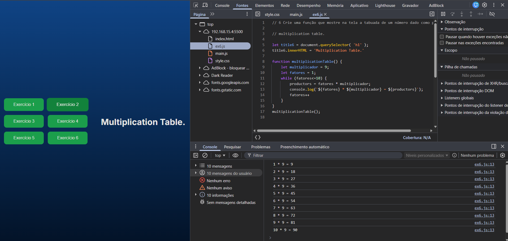

# JavaScript Challenges

Project developed to practice programming logic using JavaScript.

## 📚 Completed Challenges

### 1. BMI Calculator

Function that calculates a person's Body Mass Index (BMI) using height and weight as parameters.

### 2. Factorial Calculator

Function that calculates the factorial value of a given number.

### 3. Currency Converter

Function that converts dollar values to Brazilian reais using a fixed exchange rate of R$4.80.

### 4. Rectangular Room Area and Perimeter

Function that calculates the area and perimeter of a rectangular room using height and width.

### 5. Circular Room Area and Perimeter

Function that calculates the area and perimeter of a circular room using the radius.
PI value used: 3.14.

### 6. Multiplication Table

Function that displays the multiplication table of a given number.

---

## 🚀 Technologies Used

* HTML5
* CSS3
* JavaScript

---

## 🎯 Purpose

Practice:

* Functions
* Variables
* Mathematical operators
* Loops
* DOM manipulation
* Programming logic

---

## 📷 Preview


```md id="6o0v4u"

```

---

## ▶️ How to Run

1. Clone the repository:

```bash id="4mpnq8"
git clone [REPOSITORY_URL](https://github.com/dida0982/logica-js-projeto_inicial_2.git)
```

2. Open the `index.html` file in your browser.

---

## 👨‍💻 Author

Developed by Guilherme Barros.
